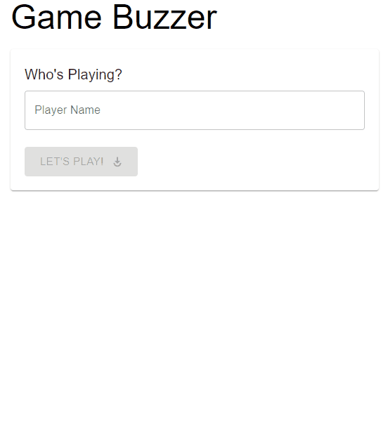

# Game Buzzer

I wanted to create a game buzzer for a video-call quiz with some friends; so I built this! It's a simple game/quiz buzzer web app that lets everyone have the app open, and when people buzz, it tells you who won and tells everyone!

It has an suitably jarring quiz buzzer sound in it as well that sounds when people buzz; the comedic effect is significant!

# Architecture

I'm using the new [Azure Static Apps](https://docs.microsoft.com/en-us/azure/static-web-apps/overview) feature for the user interface part of the application. Check out the [github action that deploys it](./.github/workflows/azure-static-web-apps-gentle-stone-0c2cbe203.yml).

I use [Azure Signalr](https://azure.microsoft.com/en-gb/services/signalr-service/) to power the real-time comms.

The Azure Functions support in Azure Static Apps doesn't support SignalR (yet?), so there is a separate Azure Functions deployment that provides
the **very** simple couple of functions that are required (written in C#, under ./api) to power the real-time comms. This is deployed by a separate [github action](./.github/workflows/functions.yml).
